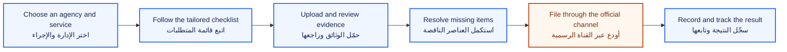
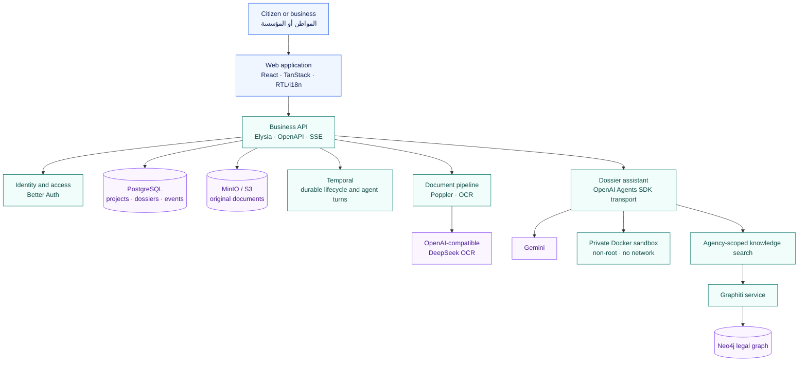

<div align="center">
  
  <h1>Dalil · دليل</h1>
  <p>
    <strong>From paperwork to a submission-ready Tunisian administrative dossier.</strong><br />
    <span dir="rtl"><strong>من الوثائق المتفرقة إلى ملف إداري تونسي جاهز للإيداع.</strong></span>
  </p>

  <p>
    <a href="#quick-start"></a>
    <a href="#how-it-works"></a>
    <a href="#arabic"></a>
  </p>

  <p>
    <a href="https://github.com/Goodnight77/Hack4Justice/actions/workflows/ci.yml"></a>
    
    
    
    
  </p>
</div>

Dalil is an open-source workspace that helps Tunisian citizens and businesses understand, assemble, validate, and track administrative procedures. It turns each procedure into a guided project with the right steps, documents, evidence, and status in one place.

The current experience covers services from the **Registre National des Entreprises (RNE)** and the **Direction Générale des Impôts (DGI)**, with Arabic right-to-left support alongside French and English.

> [!IMPORTANT]
> Dalil helps prepare and track a dossier; it does **not** file it with a government agency. The user completes the official submission on the agency's channel, then records the submission and its outcome in Dalil. Guidance is informational and does not replace advice from the competent authority or a qualified professional.

## What Dalil does

| Capability              | What it provides                                                                                                           |
| ----------------------- | -------------------------------------------------------------------------------------------------------------------------- |
| Guided procedures       | Service-specific onboarding, requirements, checklists, next actions, and a step-by-step timeline.                          |
| Document workspace      | Multi-file upload, drag-and-drop onto requirements, versioned evidence, inline PDF preview, and download.                  |
| Multilingual extraction | Native PDF text extraction plus OCR for scanned Arabic, French, and English documents.                                     |
| Grounded assistance     | A dossier-aware assistant that can search agency-scoped legal knowledge and work with authorized documents.                |
| Portable answers        | Completed assistant responses can be downloaded as Markdown or as a properly laid-out PDF.                                 |
| Submission tracking     | Readiness validation, a frozen checklist snapshot, official-channel submission records, status history, and notifications. |

### Procedures represented today

| RNE · Company registry      | DGI · Tax administration              |
| --------------------------- | ------------------------------------- |
| Company registration        | Declaration of existence and tax card |
| Company information updates | Monthly declarations                  |
| Deregistration and closure  | Annual return and tax package         |
| Electronic safe             | Tax status and certificates           |

<a id="how-it-works"></a>

## How it works



The orange step happens outside Dalil on the relevant official channel. Dalil validates readiness before that handoff and preserves what was submitted for later tracking.

## Architecture



The API is the authorization boundary. Dossier data, raw documents, knowledge searches, assistant sessions, and exports remain scoped to the authenticated user and the responsible agency. Agent work runs in an isolated, resource-limited filesystem with networking disabled.

## Response exports

Assistant output is stored as Markdown. An authorized caller can export a completed run without depending on the web interface:

```http
GET /api/v1/dossiers/:dossierId/agent/sessions/:sessionId/runs/:runId/export?format=markdown
GET /api/v1/dossiers/:dossierId/agent/sessions/:sessionId/runs/:runId/export?format=pdf
```

The Markdown response is returned as `text/markdown`; the PDF response is rendered server-side with bidirectional text and Arabic font support.

<a id="quick-start"></a>

## Quick start

### Prerequisites

- Node.js 22 or newer and Corepack
- Docker with Docker Compose
- [uv](https://docs.astral.sh/uv/) and Python 3.12+ for the Python service and its tests
- Poppler (`pdftotext` and `pdftoppm`) when exercising PDF extraction locally

### 1. Install the workspace

```bash
git clone https://github.com/Goodnight77/Hack4Justice.git
cd Hack4Justice
corepack enable
pnpm install
uv sync --locked
```

### 2. Configure the environment

```bash
cp .env.example .env
```

On PowerShell, use `Copy-Item .env.example .env`. Replace the development auth secret before sharing a deployment. Set `GEMINI_API_KEY` to enable the assistant and legal knowledge service, and set `DEEPSEEK_API_KEY` to OCR scanned documents. The checked-in [`.env.example`](.env.example) is the configuration reference.

### 3. Start infrastructure and initialize storage

```bash
docker compose up -d --wait
docker compose -f apps/api/compose.workflow.yaml up -d
pnpm --filter @hack4justice/db db:migrate
pnpm --filter @hack4justice/api db:init
```

### 4. Run the applications

Start the Temporal worker in one terminal:

```bash
pnpm --filter @hack4justice/api worker
```

Start the development applications in another:

```bash
pnpm dev
```

| Service                    | Local address                   |
| -------------------------- | ------------------------------- |
| Web application            | `http://localhost:3000`         |
| API                        | `http://localhost:3001`         |
| OpenAPI explorer           | `http://localhost:3001/openapi` |
| Graphiti knowledge service | `http://localhost:8010`         |
| Temporal UI                | `http://localhost:8233`         |
| Neo4j browser              | `http://localhost:7474`         |
| MinIO console              | `http://localhost:9001`         |

## Configuration map

| Area              | Main variables                                                                                |
| ----------------- | --------------------------------------------------------------------------------------------- |
| API and web       | `PORT`, `WEB_ORIGIN`, `VITE_API_URL`, `LOG_LEVEL`                                             |
| Identity and data | `DATABASE_URL`, `BETTER_AUTH_SECRET`, `BETTER_AUTH_URL`                                       |
| Object storage    | `S3_ENDPOINT`, `S3_REGION`, `S3_ACCESS_KEY_ID`, `S3_SECRET_ACCESS_KEY`, `S3_BUCKET`           |
| Assistant         | `GEMINI_API_KEY`, `AGENT_MODEL`, `GEMINI_AGENT_BASE_URL`, `SANDBOX_IMAGE`, `SANDBOX_BASE_DIR` |
| OCR               | `DEEPSEEK_API_KEY`, `DEEPSEEK_OCR_ENDPOINT`, `DEEPSEEK_OCR_MODEL`                             |
| Legal knowledge   | `GRAPHITI_URL`, `NEO4J_URI`, `NEO4J_USER`, `NEO4J_PASSWORD`, `GEMINI_*_MODEL`                 |
| Workflows         | `TEMPORAL_ADDRESS`, `TEMPORAL_NAMESPACE`, `TEMPORAL_TASK_QUEUE`                               |
| Messaging         | `TWILIO_ACCOUNT_SID`, `TWILIO_AUTH_TOKEN`, `TWILIO_WHATSAPP_FROM`, `TWILIO_SMS_FROM`          |

When Twilio is not configured, outbound messages are recorded as simulated so the rest of the application can still run locally.

## Repository map

```text
apps/
├── web/        React and TanStack user experience
├── api/        Elysia API, workflows, assistant, exports, and document processing
└── graphiti/   Python legal knowledge ingestion and search service
packages/
├── auth/       Better Auth integration
├── db/         Drizzle schemas and PostgreSQL migrations
├── shared/     Shared domain types, constants, and localization primitives
├── storage/    S3-compatible document storage
└── ui/         Shared interface components
contracts/      Validated schemas, fixtures, OpenAPI contract, and mock API
tests/          Python contract and knowledge-service tests
```

For deeper implementation notes, see the [API](apps/api/README.md), [web application](apps/web/README.md), [knowledge service](apps/graphiti/README.md), and [integration contracts](contracts/README.md).

## Verification

Run the same core checks used in continuous integration:

```bash
pnpm check-types
pnpm lint
pnpm test
uv run --frozen pytest tests/test_graphiti_service.py
pnpm build
```

---

<a id="arabic"></a>

<div dir="rtl" align="right">
  <h2>العربية</h2>

  <h3>ما هو دليل؟</h3>
  <p>
    <strong>دليل</strong> مساحة عمل مفتوحة المصدر تساعد المواطنين والمؤسسات في تونس على فهم الإجراءات الإدارية وتجميع وثائقها والتثبت من اكتمالها ومتابعة حالتها. يحوّل دليل كل إجراء إلى مشروع واضح يجمع المراحل والوثائق والأدلة والحالة في مكان واحد.
  </p>
  <p>
    تغطي النسخة الحالية خدمات السجل الوطني للمؤسسات (RNE) والإدارة العامة للأداءات (DGI)، وتدعم العربية باتجاه من اليمين إلى اليسار، إلى جانب الفرنسية والإنجليزية.
  </p>

  <h3>ماذا يوفّر دليل؟</h3>
  <ul>
    <li><strong>إجراءات موجّهة:</strong> اختيار الخدمة، قائمة متطلبات مناسبة، مراحل واضحة، وتعليمات للخطوة التالية.</li>
    <li><strong>مساحة للوثائق:</strong> رفع عدة ملفات، سحب الوثيقة إلى المتطلب المناسب، معاينة ملفات PDF، تنزيلها، وحفظ نسخ الأدلة.</li>
    <li><strong>استخراج متعدد اللغات:</strong> قراءة النص الأصلي من ملفات PDF واستعمال OCR للوثائق الممسوحة ضوئيا بالعربية أو الفرنسية أو الإنجليزية.</li>
    <li><strong>مساعد مرتبط بالملف:</strong> يستعمل الوثائق المصرّح بها ويبحث داخل معرفة قانونية مفصولة حسب الإدارة.</li>
    <li><strong>تصدير الأجوبة:</strong> تنزيل جواب المساعد بصيغة Markdown أو PDF مع دعم صحيح للنص العربي.</li>
    <li><strong>متابعة الإيداع:</strong> التثبت من الجاهزية، حفظ نسخة من قائمة المتطلبات، تسجيل الإيداع الرسمي، ومتابعة الحالة والإشعارات.</li>
  </ul>

  <h3>مسار الاستخدام</h3>
  <ol>
    <li>أنشئ مشروعا واختر الإدارة والخدمة المطلوبة.</li>
    <li>راجع المراحل وقائمة الوثائق الخاصة بالإجراء.</li>
    <li>ارفع الأدلة واستكمل العناصر الناقصة.</li>
    <li>بعد تأكيد الجاهزية، أودع الملف عبر القناة الرسمية للإدارة.</li>
    <li>سجّل الإيداع في دليل وتابع النتيجة والتعديلات المطلوبة.</li>
  </ol>

  <blockquote>
    <strong>تنبيه:</strong> لا يقوم دليل بإيداع الملف لدى الإدارة نيابة عن المستخدم، ولا يعوّض رأي الجهة المختصة أو الاستشارة المهنية. تتم عملية الإيداع على القناة الرسمية، ثم تُسجّل داخل دليل للمتابعة.
  </blockquote>

  <h3>تشغيل المشروع محليا</h3>
  <p>
    تتطلب البيئة Node.js 22 وDocker وpnpm. اتبع خطوات <a href="#quick-start">التشغيل السريع</a> لنسخ ملف الإعدادات، وتشغيل PostgreSQL وMinIO وNeo4j وGraphiti وTemporal، ثم تشغيل التطبيق والعامل. المفاتيح الخارجية اختيارية حسب الميزة: Gemini للمساعد والمعرفة القانونية، وDeepSeek OCR للوثائق الممسوحة ضوئيا.
  </p>
</div>

<div align="center">
  <sub>Built to make administrative procedures clearer, safer, and easier to complete.</sub><br />
  <sub dir="rtl">بُني لجعل الإجراءات الإدارية أوضح وأكثر أمانا وأسهل إنجازا.</sub>
</div>
